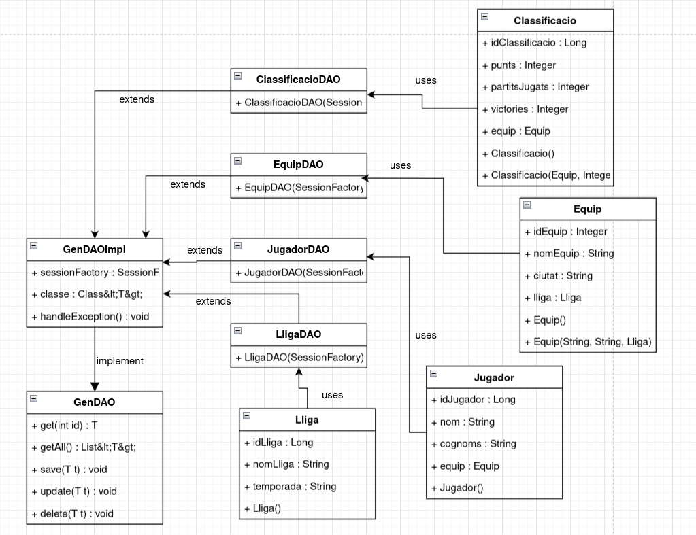

# Preguntes Apliquem el patro DAO

### [0,5 punts] De quina lògica d’aplicació s’encarrega el Patró DAO?
El patró DAO (Data Access Object) és un patró de disseny que ens permet separar la lògica de negoci de la lògica d’accés a la base de dades. Aquest patró ens permetrà accedir a la base de dades sense necessitat de conèixer els detalls de com s’accedeix a la base de dades. Això ens permetrà canviar la base de dades sense haver de modificar la lògica de negoci.

### [0,5 punts] Per què considereu què és útil el patró DAO i en què us ha servit?

El patró DAO és útil perquè permet una clara separació de responsabilitats entre la lògica de negoci i l'accés a les dades. Això facilita la mantenibilitat del codi, ja que les operacions de base de dades estan centralitzades en una única capa. A més, permet reutilitzar codi i simplifica la gestió de les transaccions i les excepcions relacionades amb l'accés a les dades. En el nostre cas, ens ha servit per simplificar el codi de les classes DAO, eliminant duplicats i centralitzant les operacions comunes en una classe abstracta

### [0,5 punts] Heu hagut de fer cap ajust al vostre codi d’aplicació (Main, Controladors, Vistes, altres classes que no siguin DAO, etc.) ? Si és així, detalleu de forma breu quins canvis heu fet i per què?

Sí, he hagut de fer alguns ajustos al codi de l'aplicació. Principalment, he modificat les classes DAO perquè estenguin la classe abstracta GenDAOImpl i implementin la interfície GenDAO. Això ha implicat eliminar codi redundant i centralitzar les operacions comunes de CRUD en la classe abstracta.

### [1,5 punts] D’igual forma que s’ha fet a l’enunciat, completeu el diagrama de classes de l’activitat A01 de la UF2 incorporant les interfícies, la classe abstracta i els DAOs. Per acoblar això, cal que relacioneu cada classe del model amb el seu DAO (sols aquelles classes que heu treballat a l’A03, no totes!!! ):

[Enlace al diagrama completat](https://drive.google.com/file/d/17-Y3E16gByFvUg6mhNjir5SOeA-4Pg4v/view?usp=sharing)

### [1 punt] Per últim valoreu el paper que hi juga la classe abstracta. És en tots els casos necessària? En el cas de l’activitat A02 de la UF2, on vau emprar JDBC, penseu que seria d’utilitat?   

La classe abstracta GenDAOImpl és molt important perquè permet reutilitzar codi i centralitzar les operacions comunes de CRUD (Crear, Llegir, Actualitzar i Eliminar). No sempre és necessària, però és molt útil quan es treballa amb diverses entitats que comparteixen funcionalitats similars.